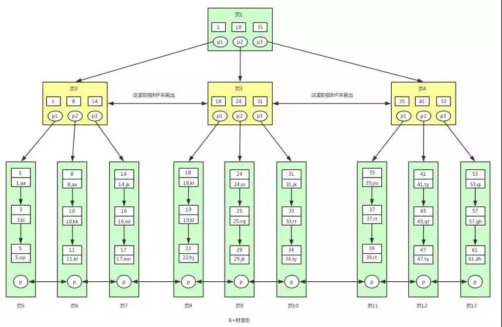

## 数据库实现
### B+ 树
已实现。主要参考下图：

首先实现了模板类 List，这里并没有使用STL库里的Vector，并不是效率原因，只是单纯想减少对标准库的依赖。List 类功能上和vector基本一致，但大小由`capacity`在初始化时固定，主要用来存储 Node 中的有效数据，包括内部节点和叶子节点都有的键、内部节点独有的 Node 指针和叶节点独有的值。包含对数据的增删改查。
> 可优化：增删改查中的遍历还是 O(n)的，结合实际情况可适当修改为二分查找（O(logn)）

接下来是抽象类 Node，它包含增删改查四个纯虚函数，以及 split 和 merge 两个纯虚函数。这些均会在子类中实现。除此之外还有一个函数`getKeyIndex`，用来判断参数 key 如果存在会在哪个子节点中被保存，并返回这个节点的索引 index 。然后利用这个 index 找到内部子节点继续判断。

子类 InternalNode 除了保存键之外，还保存一组和键对应的子节点，子节点可以是内部节点，也可以是叶节点。InternalNode 除了实现父类的纯虚函数之外还实现了`addNode`和`deleteNode`，这是对 List 操作的一个包装，将键的增删和节点的增删放在一起，算是对代码的一个小小简化，本身不具技术含量，后面的 LeafNode 类也进行了这样的实现。

子类 LeafNode 同理，实现了父类的纯虚函数之外还实现了`addValue`和`deleteValue`。

BPNode 类保存了`root`和`head` 即是树的根节点，增删改查都是基于 root 进行，而 head 节点是为了进行双向链表的遍历增设的节点，会在 root 进行增删操作自己更新时更新。

## 参考链接
### B+ 树
[wiki](https://zh.wikipedia.org/wiki/B%2B%E6%A0%91)  
[github用户1](https://github.com/SirLYC/BPTree)  
[github用户2](https://github.com/orange1438/BTree-and-BPlusTree-Realize)

### SQL 解释器
[知乎问题](https://www.zhihu.com/question/35382593)  
[github用户3](https://github.com/enpeizhao/duck_db)  
[github用户4](https://github.com/zhangqhn/mybase)  
[github用户5](https://github.com/donglinz/database)  
[github用户6](https://github.com/wangAlpha/SimpleDB)