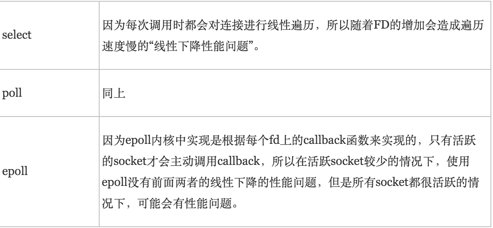
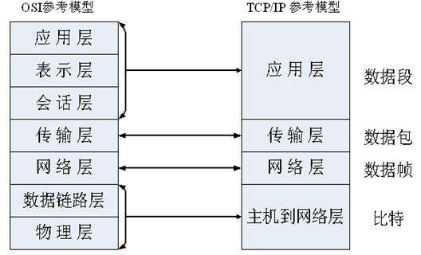
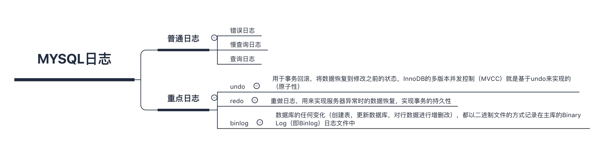

## C++ 
+ C++的左值引用等
+ vector扩容机制
    + 新增元素：Vector通过一个连续的数组存放元素，如果集合已满，在新增数据的时候，就要分配一块更大的内存，将原来的数据复制过来，释放之前的内存，在插入新增的元素；
    + 对vector的任何操作，一旦引起空间重新配置，指向原vector的所有迭代器就都失效了；
    + 初始时刻vector的capacity为0，塞入第一个元素后capacity增加为1；
    + 不同的编译器实现的扩容方式不一样，VS2015中以1.5倍扩容，GCC以2倍扩容。
+ 动态链接库
+ volatile作用
    + 用volatile关键字声明的变量i每一次被访问时，执行部件都会从i相应的内存单元中取出i的值，保证对特殊地址的稳定访问。
+ 函数式编程与面对对象编程的区别是什么
+ 请解释一下什么是单例模式中的双重检查加锁机制，它能解决什么问题
+ 迭代器失效
    + 数组型数据结构：该数据结构的元素是分配在连续的内存中，insert和erase操作，都会使得*删除点和插入点之后的元素挪位置*，所以，插入点和删除掉之后的迭代器全部失效，也就是说insert(* iter)(或erase(* iter))，然后在iter++，是没有意义的。
    解决方法：erase(*iter)的返回值是下一个有效迭代器的值。 **iter =cont.erase(iter)**;
    + 链表型数据结构：对于list型的数据结构，使用了不连续分配的内存，删除运算使指向删除位置的迭代器失效，但是不会失效其他迭代器。
    解决办法两种，erase(*iter)会返回下一个有效迭代器的值，或者erase(iter++).
    + 树形数据结构： 使用红黑树来存储数据，插入不会使得任何迭代器失效；删除运算使指向删除位置的迭代器失效，但是不会失效其他迭代器。erase迭代器只是被删元素的迭代器失效，但是返回值为void，所以要采用**erase(iter++)**的方式删除迭代器。
+ A a = new A(); 对象存在哪里,引用存在哪里（对象在堆上，引用在栈上
+ static关键字
    + 静态变量：
        + 静态局部变量存储于进程的全局数据区，即使函数返回，它的值也会保持不变。
    + 静态函数：
        + 静态函数只能在声明它的文件中可见，其他文件不能引用该函数
        + 不同的文件可以使用相同名字的静态函数，互不影响
+ 类成员继承关系
+ 多态有哪几种
    + C++多态(polymorphism)是通过虚函数来实现的，虚函数允许子类重新定义成员函数，而子类重新定义父类的做法称为覆盖(override)，或者称为重写。
+ 虚函数实现原理，纯虚函数
    + 虚函数是C++中用于实现多态的机制。核心理念就是通过基类访问派生类定义的函数.
    + 子类可以不实现基类的虚函数，但是必须实现基类的纯虚函数，否则编译会报错
    + 构造函数不能是虚函数，析构函数可以是虚函数且推荐最好设置为虚函数。
+ malloc，realloc，calloc区别
    + void* malloc(unsigned size);
    + void* realloc(void* ptr, unsigned newsize);
    + void* calloc(size_t numElements, size_t sizeOfElement);
    1. alloca是向**栈**申请内存,因此*无需释放*.
    2. malloc分配的内存是位于**堆**中的,并且没有初始化内存的内容,因此基本上malloc之后,调用函数**memset**来初始化这部分的内存空间.
    3. realloc则对malloc申请的内存进行大小的调整.
    4. calloc则将初始化这部分的内存，设置为0.

## 数据结构
+ 常见的排序算法有哪些，哪些是稳定的以及不稳定的；
    [排序算法](./sort.md)

## 计算机网络
+ 谈谈对阻塞与非阻塞、同步与异步的理解；

### I/O多路复用
+ 适用场合：
    - 当客户处理**多个描述符**时（一般是交互式输入和网络套接口），必须使用I/O复用。
    - 当一个客户同时处理**多个套接口**时，而这种情况是可能的，但很少出现。
    - 如果一个TCP服务器既要处理**监听套接口**，又要处理已**连接套接口**，一般也要用到I/O复用。
    - 如果一个服务器即要处理**TCP**，又要处理**UDP**，一般要使用I/O复用。
    - 如果一个服务器要处理**多个服务**或**多个协议**，一般要使用I/O复用。
+ 解释：I/O多路复用就是通过一种机制，一个进程可以监视多个描述符，一旦某个描述符就绪（一般是读就绪或者写就绪），能够通知程序进行相应的读写操作。
+ OS支持：系统调用（select，pselect，poll，epoll，这些本质上都是同步I/O）

#### select
+ 基本原理：
select 函数监视的文件描述符分3类，分别是writefds、readfds、和exceptfds。调用后select函数会阻塞，直到有描述符就绪（有数据 可读、可写、或者有except），或者超时（timeout指定等待时间，如果立即返回设为null即可），函数返回。当select函数返回后，可以通过遍历fdset，来找到就绪的描述符。

+ 本质：通过设置或者检查存放fd标志位的数据结构来进行下一步处理。
    + 缺点：
        1. 单个进程所打开的FD是有一定限制的，它由FD_SETSIZE设置，默认值是1024。
        2. 对socket进行扫描时是线性扫描，即采用轮询的方法，效率较低
        3. 需要维护一个用来存放大量fd的数据结构，这样会使得用户空间和内核空间在传递该结构时复制开销大

+ 优点：良好的跨平台支持性
+ 缺点：单个进程能够监视的文件描述符的数量存在最大限制（Linux上是1024）

#### poll
+ 基本原理
poll本质上和select没有区别，它将用户传入的数组拷贝到内核空间，然后查询每个fd对应的设备状态，如果设备就绪则在设备等待队列中加入一项并继续遍历，如果遍历完所有fd后没有发现就绪设备，则挂起当前进程，直到设备就绪或者主动超时，被唤醒后它又要再次遍历fd。这个过程经历了多次无谓的遍历。

+ 本质：基于链表存储
    + 优点：它没有最大连接数的限制
    + 缺点：
        1. 大量的fd的数组被整体复制于用户态和内核地址空间之间，而不管这样的复制是不是有意义。
        2. poll还有一个特点是“水平触发”，如果报告了fd后，没有被处理，那么下次poll时会再次报告该fd。

+ 注意：
从上面看，select和poll都需要在返回后，通过遍历文件描述符来获取已经就绪的socket。事实上，同时连接的大量客户端在一时刻可能只有很少的处于就绪状态，因此随着监视的描述符数量的增长，其效率也会线性下降（遍历导致性能下降）

#### epoll
+ 基本原理：
epoll支持水平触发和边缘触发，最大的特点在于**边缘触发**，它**只告诉进程哪些fd刚刚变为就绪态，并且只会通知一次**。还有一个特点是，epoll使用“事件”的就绪通知方式，通过epoll_ctl注册fd，一旦该fd就绪，内核就会采用类似callback的回调机制来激活该fd，epoll_wait便可以收到通知。

+ 优点：
1. 没有最大并发连接的限制，能打开的FD的上限远大于1024（1G的内存上能监听约10万个端口）。
2. 效率提升，不是轮询的方式，不会随着FD数目的增加效率下降。只有活跃可用的FD才会调用callback函数；即Epoll最大的优点就在于它只管你“活跃”的连接，而跟连接总数无关，因此在实际的网络环境中，Epoll的效率就会远远高于select和poll。
3. 内存拷贝，利用mmap()文件映射内存加速与内核空间的消息传递；即epoll使用mmap减少复制开销。

+ epoll对文件描述符的操作有两种模式：LT（level trigger）和ET（edge trigger）。LT模式是默认模式，LT模式与ET模式的区别如下：
    > LT模式：当epoll_wait检测到描述符事件发生并将此事件通知应用程序，应用程序可以不立即处理该事件。下次调用epoll_wait时，会再次响应应用程序并通知此事件。
    > ET模式：当epoll_wait检测到描述符事件发生并将此事件通知应用程序，应用程序必须立即处理该事件。如果不处理，下次调用epoll_wait时，不会再次响应应用程序并通知此事件。

+ 注意：
如果没有大量的idle-connection或者dead-connection，epoll的效率并不会比select/poll高很多，但是当遇到大量的idle-connection，就会发现epoll的效率大大高于select/poll。

#### select、poll、epoll区别
1. 支持一个进程所能打开的最大连接数
    
2. FD剧增后带来的IO效率问题
    
3. 消息传递方式
    

+ 进行一次IO操作大致所需要的流程；

### 网络模型

+ 区别
开放式系统互联模型是一个参考标准，解释协议相互之间应该如何相互作用。TCP/IP协议是美国国防部发明的，是让互联网成为了目前这个样子的标准之一。开放式系统互联模型中没有清楚地描绘TCP/IP协议，但是在解释TCP/IP协议时很容易想到开放式系统互联模型。
    1. TCP/IP协议中的应用层处理开放式系统互联模型中的第五层、第六层和第七层的功能。
    2. TCP/IP协议中的传输层并不能总是保证在传输层可靠地传输数据包，而开放式系统互联模型可以做到。
        这是因为TCP/IP协议还提供一项名为UDP（用户数据报协议）的选择。UDP不能保证可靠的数据包传输。

#### 开放式系统互联(OSI)网络模型
>**应用层** 文件传输，电子邮件，文件服务，虚拟终端 **HTTP**，**FTP**，**DNS**，Telnet，TFTP，SNMP，SMTP
>表示层 数据格式化，代码转换，数据加密 没有协议
>会话层 解除或建立与别的接点的联系 没有协议
>**传输层** 提供端对端的接口 **TCP**，**UDP**
>**网络层** 为数据包选择路由 **IP**，ICMP，RIP，OSPF，BGP，IGMP
>**数据链路层** 传输有地址的帧以及错误检测功能 **ARP**，**RARP**，SLIP，CSLIP，PPP，MTU
>**物理层** 以二进制数据形式在物理媒体上传输数据 ISO2110，IEEE802，IEEE802.2

1. 物理层
物理层的主要功能是完成相邻节点之间原始比特流的传输，它关心的典型问题是，使用什么样的物理信号（电信号或者光信号）来表示数据“0”和“1”。通俗的来说，物理层要做的就是使用怎么样的物理信号来表示数据。物理层常用的网络设备有中继器和集线器。

2. 数据链路层
数据链路层的主要功能是在不可靠的物理线路上进行数据的可靠传输，为了保证数据的可靠传输，发送方把数据封装成帧的形式。该层作用的区域为局域网。通俗的说，数据链路层的主要功能就是将数据以帧的形式进行传输。数据链路层的常用网络设备有网桥，交换机，网卡等。

3. 网络层
网络层的主要功能是完成网络中主机间的报文传输，它对应的是网络主机到网络主机的报文传输。该层说到底还是数据的传输，只不过是网络中主机到主机的网络传输，它传输数据依据的是主机的IP地址。该层常用的网络设备有路由器，三层交换机等。

4. 传输层
传输层的主要功能是完成网络中不同主机上的用户进程之间可靠的数据通信，传输层是真正的端到端的连接。换言之，源端主机上的某进程是利用报文头和控制报文与目标主机上的对等进程进行对话。通俗的来说，传输层的实质也是传输数据，只不过它对应的直接是进程与进程之间的数据传输，它依据的是进程的端口号（比如WWW服务的端口号是80，FTP服务的端口号是21等）。

5. 会话层
会话层允许不同机器上的用户之间建立会话关系。会话层提供的服务之一是管理对话控制。会话层是一种与对话控制有关的令牌管理（就像是十字路口的红绿灯一样，控制着哪个方向的车流什么时候通行，什么时候禁止通行），它相当于一个智能管家，对数据进行有序的传输控制。

6. 表示层
表示层关心的是所传送信息的语法和语义。表示层服务的一个典型例子是用一种大家都能理解的标准方法对数据进行编码。简单来说，表示层就是对数据的解码，解释成程序都能理解的程序语言。

7. 应用层
网络的目的在于支持运行于不同计算机的进程之间的通信，而这些进程则是为用户完成不同任务而设计的。应用层的功能就是将解码后的计算机程序语言表示出来，从而展示给用户，实现用户操作计算机程序的目的。

#### TCP/IP协议

| TCP | UDP |
| --- | --- |
|面向连接的、可靠的|缺乏可靠性|
|字节流|数据报有长度，数据报包含长度直接发送|
|使用校验和，确认和重传机制来保证可靠传输|不提供确认、序列号、超时重传等机制，不保证数据到达目的地，也不保证只到达一次|
|给数据分节进行排序，并使用累积确认保证数据的顺序不变和非重复|以包为单位发送|
|滑动窗口机制来实现流量控制，通过动态改变窗口的大小进行拥塞控制|无|
|发包前先建立链接|无连接的|

##### 三次握手
所谓三次握手(Three-way Handshake)，是指建立一个 TCP 连接时，需要客户端和服务器总共发送3个包。

三次握手的目的是连接服务器指定端口，建立 TCP 连接，并同步连接双方的序列号和确认号，交换 TCP 窗口大小信息。在 socket 编程中，客户端执行 connect() 时。将触发三次握手。

+ 第一次握手(SYN=1, seq=x):

    客户端发送一个 TCP 的 SYN 标志位置1的包，指明客户端打算连接的服务器的端口，以及初始序号 X,保存在包头的 **序列号(Sequence Number)** 字段里。

    发送完毕后，客户端进入 **SYN_SEND** 状态。

+ 第二次握手(SYN=1, ACK=1, seq=y, ACKnum=x+1):

    服务器发回确认包(ACK)应答。即 SYN 标志位和 ACK 标志位均为1。服务器端选择自己 **ISN** 序列号，放到 Seq 域里，同时将确认序号(Acknowledgement Number)设置为客户的 ISN 加1，即X+1。 发送完毕后，服务器端进入 **SYN_RCVD** 状态。

+ 第三次握手(ACK=1，ACKnum=y+1)

    客户端再次发送确认包(ACK)，SYN 标志位为0，ACK 标志位为1，并且把服务器发来 ACK 的序号字段+1，放在确定字段中发送给对方，并且在数据段放写ISN的+1

    发送完毕后，客户端进入 **ESTABLISHED** 状态，当服务器端接收到这个包时，也进入 **ESTABLISHED** 状态，TCP 握手结束。

##### 四次挥手
TCP 的连接的拆除需要发送四个包，因此称为四次挥手(Four-way handshake)，也叫做改进的三次握手。客户端或服务器均可主动发起挥手动作，在 socket 编程中，任何一方执行 close() 操作即可产生挥手操作。

+ 第一次挥手(FIN=1，seq=x)

    假设客户端想要关闭连接，客户端发送一个 **FIN** 标志位置为1的包，表示自己已经没有数据可以发送了，但是仍然可以接受数据。

    发送完毕后，客户端进入 **FIN_WAIT_1** 状态。

+ 第二次挥手(ACK=1，ACKnum=x+1)

    服务器端确认客户端的 FIN 包，发送一个确认包，表明自己接受到了客户端关闭连接的请求，但还没有准备好关闭连接。

    发送完毕后，服务器端进入 **CLOSE_WAIT** 状态，客户端接收到这个确认包之后，进入 **FIN_WAIT_2** 状态，等待服务器端关闭连接。

+ 第三次挥手(FIN=1，seq=y)

    服务器端准备好关闭连接时，向客户端发送结束连接请求，FIN 置为1。

    发送完毕后，服务器端进入 **LAST_ACK** 状态，等待来自客户端的最后一个ACK。

+ 第四次挥手(ACK=1，ACKnum=y+1)

    客户端接收到来自服务器端的关闭请求，发送一个确认包，并进入 **TIME_WAIT** 状态，等待可能出现的要求重传的 ACK 包。

    服务器端接收到这个确认包之后，关闭连接，进入 **CLOSED** 状态。

客户端等待了**某个固定时间**（两个最大段生命周期，**2MSL，2 Maximum Segment Lifetime**）之后，没有收到服务器端的 ACK ，认为服务器端已经正常关闭连接，于是自己也关闭连接，进入 **CLOSED** 状态。

#### TCP拥塞机制
+ 流量控制：接受方**滑动窗口**控制接受包的顺序以及是否到达。
+ 拥塞控制：
    发送方维持一个叫做**拥塞窗口cwnd(congestion window)的状态变量**，通过以下4个算法控制cwnd的变化以实现对发包速度的控制
    为了防止cwnd增长过大引起网络拥塞，还需设置一个**慢开始门限ssthresh状态变量**
    + 慢开始：在TCP开始发送报文段时先设置cwnd=1，然后逐渐增大；
        + 每经过一个传输伦次（RTT），cwnd就加倍；
        + 当cwnd > ssthresh时，改用拥塞避免算法；
    + 拥塞避免：每经过一个往返时间RTT就把发送方的拥塞窗口cwnd加1，而不是加倍。这样拥塞窗口按线性规律缓慢增长。
        + 论是在慢开始阶段还是在拥塞避免阶段，只要发送方判断网络出现拥塞（其根据就是没有按时收到确认，虽然没有收到确认可能是其他原因的分组丢失，但是因为无法判定，所以都当做拥塞来处理），就把**慢开始门限ssthresh设置为出现拥塞时的发送窗口大小的一半**（但不能小于2）。*然后把拥塞窗口cwnd重新设置为1，执行慢开始算法*。
    + 快重传：要求接收方在收到一个失序的报文段后就立即发出重复确认
        + 快重传算法规定，发送方只要一连收到三个重复确认就应当立即重传对方尚未收到的报文段，而不必继续等待设置的重传计时器时间到期
    + 快恢复：当发送方连续收到三个重复确认时，就执行“乘法减小”算法，把ssthresh门限减半
        + 不执行慢开始算法，而是将cwnd设置为ssthresh减半后的值，然后执行拥塞避免算法，使cwnd缓慢增大（能收到3个重复应该不会堵塞吧...）

### HTTP(s)
+ http头部
通常HTTP消息包括**客户机向服务器的请求消息**和**服务器向客户机的响应消息**。
这两种类型的消息由一个起始行，一个或者多个头域，一个只是头域结束的空行和可选的消息体组成。HTTP的头域包括**通用头**，**请求头**，**响应头**和**实体**头四个部分。
    + 通用头域
    + 请求消息（请求头）：格式：Method Request-URI HTTP-Version
        + Method: 大小写敏感，包括GET、HEAD、POST、PUT、DELETE
        + Request-URI: 表示请求的URL。Request-URI遵循URI格式，在此字段为星号（*）时，说明请求并不用于某个特定的资源地址，而是用于服务器本身
        + HTTP-Version: 表示支持的HTTP版本，例如为HTTP/1.1
    + 响应消息（响应头）：格式：HTTP-Version Status-Code Reason-Phrase
        + HTTP-Version表示支持的HTTP版本，例如为HTTP/1.1
        + Status-Code是一个三个数字的结果代码
        + Reason-Phrase给Status-Code提供一个简单的文本描述
    + 实体消息（实体头和实体）
        请求消息和响应消息都可以包含实体信息，实体信息一般由实体头域和实体组成。

        + 实体头域包含关于实体的原信息，实体头包括Allow、Content- Base、Content-Encoding、Content-Language、Content-Length、Content-Location、Content-MD5、Content-Range、Content-Type、 Etag、Expires、Last-Modified、extension-header。extension-header允许客户端定义新的实体头，但是这些域可能无法为接受方识别。

        > Content-Type实体头用于向接收方指示实体的介质类型，指定HEAD方法送到接收方的实体介质类型，或GET方法发送的请求介质类型，表示后面的文档属于什么MIME类型。
        Content-Length表示实际传送的字节数。
        Allow 实体头至服务器支持哪些请求方法（如GET、POST等）。
        Content-Range表示传送的范围，用于指定整个实体中的一部分的插入位置，他也指示了整个实体的长度。在服务器向客户返回一个部分响应，它必须描述响应覆盖的范围和整个实体长度。
        Content-Encoding 指文档的编码（Encode）方法。

        + 实体可以是一个经过编码的字节流，它的编码方式由Content-Encoding或Content-Type定义，它的长度由Content-Length或Content-Range定义。

+ http状态码
    |状态码|含义|
    |---|---|
    |1xx|信息性状态码，表示服务器已接收了客户端请求，客户端可继续发送请求|
    |2xx|成功状态码，表示服务器已成功接收到请求并进行处理|
    |3xx|用户已经移动的文件并且常被包含在定位头信息中指定的新的地址信息|
    |4xx|用户指定客户端的错误|
    |5xx|用户指定服务器的错误|

+ http请求方法
    |请求方法|含义|
    |---|---|
    |GET|向特定的资源发出请求|
    |POST|向指定资源提交数据进行处理请求（例如提交表单或者上传文件）。数据被包含在请求体中。POST请求可能会导致新的资源的创建和/或已有资源的修改。|
    |PUT|向指定资源上传最新内容|
    |DELETE|请求服务器删除Request-URI所标识的资源|
    |HEAD|向服务器索要与GET请求相一致的响应，只不过响应体将不会被返回。这一方法可以在不必传输整个响应内容的情况下，就可以获取包含在响应消息头中的元信息。|
 
    + GET与POST区别

    |GET|POST|
    |---|---|
    |GET在浏览器回退时是无害的|POST会再次提交请求|
    |GET产生的URL地址可以被Bookmark|POST不可以|
    |GET请求会被浏览器主动cache|POST不会，除非手动设置|
    |GET请求只能进行url编码|POST支持多种编码方式|
    |GET请求参数会被完整保留在浏览器历史记录里|POST中的参数不会被保留|
    |GET请求在URL中传送的参数是有长度限制的|POST没有|
    |对参数的数据类型，GET只接受ASCII字符|POST没有限制|
    |GET不安全，因为参数直接暴露在URL上，所以不能用来传递敏感信息|POST更安全|
    |GET参数通过URL传递|POST放在Request body中|

+ http无状态
无状态是指协议对于事务处理没有记忆能力，服务器不知道客户端是什么状态。即我们给服务器发送 HTTP请求之后，服务器根据请求，会给我们发送数据过来，但是发送完不会记录任何信息。
    + Cookie：服务端生成，**客户端保存**，用于用户端发送信息时验证身份，避免多次登录等。（明文，不安全；与域名有关，保证不会跨域）
    + Session：**服务器保持客户端会话信息**，用于标识的Sessionid传递给客户端浏览器（存在客户端内存中，不会存在Cookie临时文件里）。Session超时即删（服务器压力较大）

+ 打开一个URL经过哪些流程
    + 域名解析: DNS解析 = 本地解析 + 远程解析 
        + 浏览器缓存->系统缓存(hosts文件)->本机缓存->路由器缓存->本地域名服务器->权限域名服务器->顶级域名服务器->根域名服务器
    + 网络协议发送包到服务端，服务端返回处理结果，本地开始渲染

+ 递归查询和迭代查询的区别

    + 递归查询
    如果主机所询问的本地域名服务器不知道被查询的域名的IP地址，那么本地域名服务器就以DNS客户的身份，向其它根域名服务器继续发出查询请求报文(即替主机继续查询)，而不是让主机自己进行下一步查询

    + 迭代查询
    当根域名服务器收到本地域名服务器发出的迭代查询请求报文时，要么给出所要查询的IP地址，要么告诉本地服务器：“你下一步应当向哪一个域名服务器进行查询”。然后让本地服务器进行后续的查询
    
    + 总结：
        + 主机向本地域名服务器的查询一般都是采用递归查询。
        + 本地域名服务器向根域名服务器的查询通常是采用迭代查询

## 操作系统
+ 进程和线程之间的区别，多进程和多线程各自使用情况，进程和线程之间通信方式；
+ 内存分配的事情？当时回答不太熟就没接着问了
+ 进程线程
+ 进程通信方式
+ 死锁
+ 进程和线程的定义，进程可以操作哪些资源，进程的内存控制
+ 用户态和内核态的区别
+ 为什么区分用户态和内核态（保护和公平）
+ 虚拟内存和物理内存的区别是什么
+ 页表的原理
+ 什么是段页式存储
+ 快存，虚存，主存，外存都是什么
+ 虚拟内存和物理内存转换
+ 换页算法
+ LRU怎么在外存中找到需要的页？LRU怎么找到最久未使用的页

## 数据库
+ 底层数据机构：B+树
+ 常用引擎：InnoDB、Myisam
+ 索引：
    索引是一种用来实现 MySQL 高效获取数据的数据结构。

    我们通常所说的在某个字段上建索引，意思就是让 MySQL 对该字段以索引这种数据结构来存储，然后查找的时候就有对应的查找算法。

    建索引的根本目的是为了查找的优化，特别是当数据很庞大的时候，一般的查找算法有顺序查找、折半查找、快速查找等。

    但是每种查找算法都只能应用于特定的数据结构之上，例如顺序查找依赖于顺序结构，折半查找通过二叉查找树或红黑树实现二分搜索。因此在数据之外，数据库系统还维护着满足特定查找算法的数据结构。

    这些数据结构以某种方式引用数据，这样就可以在这些数据结构上实现高级查找算法，这种数据结构就是索引。

+ 二级索引：二级索引存储的是记录的主键，而不是数据存储的地址。
    + 唯一索引、普通索引、前缀索引等都是二级索引（辅助索引）
    + 通过二级索引可以查找到目标行所对应的主键，也就是主键索引的id，然后再用这个id去主键索引里查询。

### InnoDB
InnoDB 的存储文件有两个，后缀名分别是 .frm 和 .idb，其中 .frm 是表的定义文件，而 idb 是数据文件。

InnoDB 中存在表锁和行锁，不过行锁是在命中索引的情况下才会起作用。

InnoDB 支持事务，且支持四种隔离级别（读未提交、读已提交、可重复读、串行化），默认的为可重复读；而在 Oracle 数据库中，只支持串行化级别和读已提交这两种级别，其中默认的为读已提交级别。

InnoDB用的是聚簇索引，B+树里存的是键值对，叶子节点本身由双向链表连接，可以支持线性查找和根节点的随机查找

+ B+树的实现原理，为什么innodb不用红黑树用B+树？
因为红黑树是二叉树，数据量大的时候红黑树深度过大，磁盘和内存的IO次数太多，效率太低。

### Myisam
Myisam 的存储文件有三个，后缀名分别是 .frm、.MYD、MYI，其中 .frm 是表的定义文件，.MYD 是数据文件，.MYI 是索引文件。

Myisam 只支持表锁，且不支持事务。Myisam 由于有单独的索引文件，在读取数据方面的性能很高 。

Myisam引擎用的是非聚簇引擎，因为数据和索引不在一起，存储索引的B+树的叶子节点里存的是数据记录的地址。

+ ACID是什么？持久性的原理说一下
    执行事务。ACID中的一致性（Consistency），而原子性（Atomicity）、隔离性（Isolation）、持久性（Durability）。

+ 一个表，第一列是id，第二列是金额，A给B转钱，怎么做？（说了开启事务做操作
+ 并发的情况下怎么保证不会多转钱（说了mysql会加锁，说了说3个行锁
+ 怎么加行锁
    创建行锁条件：
        1、表中创建索引， select ... where   字段（必须是索引）不然行锁就无效。
        2、必须要有事务，这样才是 行锁（排他锁）
            + START TRANSACTION;  #加事务
                SELECT UserID,Password,Age FROM AccountsDB.Accounts_InFo WHERE Accounts = 'hello2' FOR UPDATE; #加锁
                COMMIT; #提交
        3、在select语句后面加上**FOR UPDATE**；

+ Mysql的隔离级别，每个隔离级别怎么实现的。
    + Read Uncommitted：最低的隔离级别，一个事务可以读到另一个事务未提交的结果。所有的并发事务问题都会发生。
    + Read Committed：只有在事务提交后，其更新结果才会被其他事务看见。可以解决**脏读**问题。
    + Repeated Read：在一个事务中，对于同一份数据的读取结果总是相同的，无论是否有其他事务对这份数据进行操作，以及这个事务是否提交。可以解决**脏读**、**不可重复读**。
    + Serialization：事务串行化执行，隔离级别最高，*牺牲了系统的并发性*。可以解决并发事务的所有问题。
+ 事务的原子性怎么实现的。
    + All or Nothing，支持rollback操作(执行失败可恢复)
+ 数据库里面有哪几种日志。
    
    

    + redo
    介绍redo 日志是什么时，需要先回顾一下操作数据库数据的逻辑，一般是这样：首先，从数据库文件中找到记录，文件一般是按照一种特定的格式存放，比如页，然后加载整页数据到内存，在内存中进行数据的操作（脏页）然后将脏页同步回文件，一般不会立即将脏页刷回到磁盘，这样会产生大量的随机IO操作，性能低下，如果不立即刷回磁盘，那么当服务器挂掉后，存放在内存中的数据会丢失，造成数据的不一致性，也就无从持久化。为了解决这一矛盾，引入了redo日志。

    + undo
    undo日志是取消操作，用于事务回滚，将数据恢复到修改之前的状态，InnoDB的多版本并发控制（MVCC）就是基于undo来实现的 （原子性）

    小结：redo与undo是MySQL存储引擎级别的日志，俗称事务日志，与事务的实现息息相关

### Java
+ final关键字的作用
+ java 多线程加锁
+ unordered_map的底层原理说一下，它是怎么解决哈希冲突的
+ GC如何回收垃圾？引用计数法 可达性分析（可达性分析如何解决循环引用？引用计数有什么优点？为什么简单就性能好？）
+ 接口和抽象类区别（什么情况你用接口什么情况用抽象类（举例子））

### redis
+ Redis主从复制
+ Redis持久化

### spring boot
+ spring Ioc底层原理

### 最新面经
今天下午面试，连续三面，每面之间隔两分钟，面试官判断是否继续，我手撕代码分几面说吧，然后其他的内容的话，直接分块说一下自己所回忆的。
手撕代码：
一面：括号匹配算法；统计一个日志文件（里面存放的是id,每访问一次会有一行id）前10个出现的id；OK，继续优化，如果这个日志文件很大，那我们内存放不下，放在外存你会怎么做（先分块，再把id相同的映射到同一个块，hash,或者取模可以做到，面试官提示的）；
二面：最长不重复子串（双指针就可以了，这里我比较蠢，用了一个set,不过也可以解出来）；机器人走路算法（DFS+标记算法，可以写伪代码解释，我写了代码，但面试官说回溯有点标记问题），左上角走到右下角，求可能的路径中和最小的那个值；
三面：也不说什么了，既然操作系统页面置换算法又LRU，那么我们手撕一个LRU算法吧（Java内部LinkedHashMap实现了，但是如果用，就0分，面试官说的，手动模拟LRU，这个建议大家好好写一下吧，我实验室朋友前面面的另外一个部门也有手撕）：需要一个put和get方法，具体的是需要HashMap和双链表去实现的，感兴趣的可以看看LeetCode有原题（在面试官的指导下完成，之前写的有些忘记了）。
面试内容：
数据库：四种隔离级别；三种问题（脏读，不可重复度，幻读的问题）；如果不用串行化，如何解决三种存在的问题（不用串行化，如何保持高的效率，也不会出现问题）；MySQL有哪些索引，介绍一下B+树具体的结构；聚集索引和非聚集索引；用过哪些数据库。
操作系统：内存，外存，虚拟内存，Cache的作用以及相关的原理（自述）；缺页中断有哪些算法；同样的问题，外部有个大文件，内存放不下，我们应该如何处理（答了分块，多线程mmap）;mmap如何进行内存映射的；说一下栈和堆吧，栈的效率会比较高，那么栈和堆有哪些用处和区别（首先答了多线程共享资源问题，从Java角度解释，多线程每个线程维护自己的栈，但堆是共享，会出现资源争夺的问题。其次从资源回收角度介绍了一下， 堆中的对象需要我们手动释放或者JVM回收，栈中的数据通常伴随着方***压栈或者弹出，从两个角度介绍）。
计算机网络：打开一个URL经过哪些流程，顺带说一下协议；HTTP的无状态是什么意思；TCP和UDP的区别是什么，是什么导致了TCP效率比较慢；拥塞避免具体的四个过程，每个过程如何实现的。
Java相关：Spring框架中，说一下IOC和AOP吧；线程池说一下实现原理；说一下你了解的Java中的map的线程安全问题（HashMap, HashTable, ConcurrentHashMap,说一下底层原理）；什么时候会发生垃圾回收；Volatile的原理；还有一些自己项目相关的问题就不说了。
大概就问了这些问题，总而言之，字节跳动的考察还是比较全面的，等通知，诸君共勉吧。

算法：

### 算法题
+ char[] "i am in Shanghai" -> char[] "shanghai in am i"(不让用String split函数，只能用reverese实现。后来说了思路 就是先反转整个句子，再单独反转单词。)
+ 判断回文链表
+ 二叉树层序遍历LC102
+ 3sum
+ 单例模式
+ 若有一个函数，返回0的概率是60%，返回1的概率是40%，如何利用这个函数获得50%的概率
+ 设计一个栈，O(1)复杂度求最小值
+ 有序数组旋转后找最小值所在位置、给出一个有环的链表输出环的长度；
+ 二叉树层序遍历
+ 二叉树和为target的路径：定义从根节点开始、叶子节点结束为一条路径，返回所有和为target的路径。（DFS+Backtrack）
+ 给定一个字符串，如“abdkfcefbikbaabbsdsbb”，删除其中所有连续的"ab"，最后的结果没有连续的"ab"。
+ 单链表L1->L2->L3->……->Ln-1->Ln 转换成 L1->Ln->L2->Ln-1->L3……
+ 翻转链表
+ 判断两个二叉树是否完全相同
+ 手撕LRU算法，并写测试用例验证

## 参考链接
[malloc, realloc, calloc区别](https://www.jianshu.com/p/718f68a092b0)
[github博客](https://hit-alibaba.github.io/interview)
[HTTP状态码详解](https://www.jianshu.com/p/93555718732a)
[HTTP头部详解](https://blog.csdn.net/YLBF_DEV/article/details/50266447)
[打开url](https://www.jianshu.com/p/d616d887953a)
[数据库explain关键字](https://www.jianshu.com/p/ca54f1c9dd31)