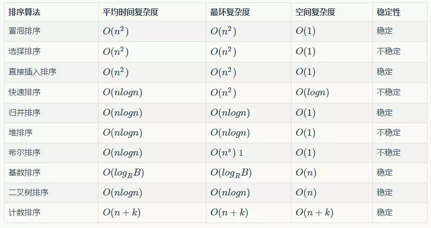

## 排序算法



### 冒泡排序
+ 算法原理
相邻的数据进行两两比较，小数放在前面，大数放在后面，这样一趟下来，最小的数就被排在了第一位，第二趟也是如此，如此类推，直到所有的数据排序完成。

```c++
void bubble_sort(vector<int> &a)
{
    int length = a.size();
    for(int i=0; i<length-1; i++){
        for(int j=i+1; j<length; j++){
            int min = a[i] <= a[j] ? a[i] : a[j];
            int max = a[i] <= a[j] ? a[j] : a[i];
            a[i] = min;
            a[j] = max;
        }
    }
}
```

### 选择排序
+ 算法原理
先在未排序序列中找到最小（大）元素，存放到排序序列的起始位置，然后，再从剩余未排序元素中继续寻找最小（大）元素，然后放到已排序序列的末尾。以此类推，直到所有元素均排序完毕。

    与冒泡排序差别不大，需要注意的是冒泡排序每一次都需要访问数组进行值的修改，而选择排序只修改临时值，最后遍历一遍之后修改一次。


```c++
void select_sort(vector<int> &a)
{
    int length = a.size();
    for(int i=0; i<length-1; i++){
        int index = i;
        for(int j=i+1; j<length; j++){
            if(a[index] > a[j]){
                index = j;
            }
        }
        if(index != i){
            int tmp = a[i];
            a[i] = a[index];
            a[index] = tmp;
        }
    }
}
```
### 插入排序
+ 算法原理
将数据分为两部分，有序部分与无序部分，一开始有序部分包含第1个元素，依次将无序的元素插入到有序部分，直到所有元素有序。插入排序又分为直接插入排序、二分插入排序、链表插入等，这里只讨论直接插入排序。它是稳定的排序算法，时间复杂度为O(n^2)。

```c++
void insert_sort(vector<int> &a)
{
    int length = a.size();
    vector<int> tmp;
    for(int i=0; i<length; i++){
        int len = tmp.size(), j=0;
        for(; j<len; j++){
            if(a[i] <= tmp[j]){
                tmp.insert(tmp.begin()+j, a[i]);
                break;
            }
        }
        if(j==len){
            tmp.push_back(a[i]);
        }
        print(tmp);
    }

    // copy into original vector
    for(int i=0; i<length; i++){
        a[i] = tmp[i];
    }
}
```

### 快速排序
+ 算法原理
快速排序是目前在实践中非常高效的一种排序算法，它不是稳定的排序算法，平均时间复杂度为O(nlogn)，最差情况下复杂度为O(n^2)。它的基本思想是：通过一趟排序将要排序的数据分割成独立的两部分，其中一部分的所有数据都比另外一部分的所有数据都要小，然后再按此方法对这两部分数据分别进行快速排序，整个排序过程可以递归进行，以此达到整个数据变成有序序列。

```c++
void quick_sort(vector<int> &a, int low, int high)
{
    if(high <= low){return;}
    if(high == low+1){
        int min = a[low] < a[high] ? a[low] : a[high];
        int max = a[low] < a[high] ? a[high] : a[low];
        a[low] = min;
        a[high] = max;
        return;
    }

    int target = a[low];
    int p = high;
    for(int i=low+1; i<=high; i++){
        if(a[i] > target){
            int tmp = a[i];
            a[i] = a[p];
            a[p] = tmp;
            p--;
        }
    }
    a[low] = a[p];
    a[p] = target;
    quick_sort(a, low, p-1);
    quick_sort(a, p+1, high);
}
```

### 归并排序
+ 算法原理
归并排序具体工作原理如下（假设序列共有n个元素）：

    + 将序列每相邻两个数字进行归并操作（merge)，形成floor(n/2)个序列，排序后每个序列包含两个元素
    + 将上述序列再次归并，形成floor(n/4)个序列，每个序列包含四个元素
    + 重复步骤2，直到所有元素排序完毕

    归并排序是稳定的排序算法，其时间复杂度为O(nlogn)，如果是使用链表的实现的话，空间复杂度可以达到O(1)，但如果是使用数组来存储数据的话，在归并的过程中，需要临时空间来存储归并好的数据，所以空间复杂度为O(n)。

```c++
void merge(vector<int> &a, int low, int high)
{
    if(high <= low){return;}
    if(high == low+1){
       int min = a[low] < a[high] ? a[low] : a[high];
       int max = a[low] < a[high] ? a[high] : a[low];
       a[low] = min;
       a[high] = max;
       return;
    }

    vector<int> out;
    int mid = (high + low) /2;
    merge(a, low, mid);
    merge(a, mid+1, high);
    int p=low, q=mid+1;
    while(p<=mid && q<=high){
        if(a[p] <= a[q]){
            out.push_back(a[p]);
            p++;
        }else{
            out.push_back(a[q]);
            q++;
        }
    }
    while(p <= mid){
        out.push_back(a[p]);
        p++;
    }
    while(q <= high){
        out.push_back(a[q]);
        q++;
    }
    for(int i=low; i<=high; i++){
        a[i] = out[i-low];
    }
}

void merge_sort(vector<int> &a)
{
    int length = a.size();
    merge(a, 0, length-1);
}
```

### 堆排序
堆排序的时间复杂度为O(nlogn)

+ 算法原理（以最大堆为例）
    + 先将初始数据R[1..n]建成一个最大堆，此堆为初始的无序区
    + 再将关键字最大的记录R[1]（即堆顶）和无序区的最后一个记录R[n]交换，由此得到新的无序区R[1..n-1]和有序区R[n]，且满足R[1..n-1].keys≤R[n].key
    + 由于交换后新的根R[1]可能违反堆性质，故应将当前无序区R[1..n-1]调整为堆。
    + 重复2、3步骤，直到无序区只有一个元素为止。

+ 注意：堆的完整实现本身比较复杂，在遍历得到最值之后还需要往下遍历以形成标准的堆。但这里不同，这里每次只需要利用堆得到最值，因此往下的遍历可以省略。也就是说，下面实现的堆是不彻底的，只有最值得到了保证。

```c++
void make_heap(vector<int> &a, int high)
{
    for(int i=high; i>0; i--){
        int p = (i-1) / 2;
        if(a[i] > a[p]){
            int tmp = a[p];
            a[p] = a[i];
            a[i] = tmp;
        }
    }
}

void heap_sort(vector<int> &a)
{
    int length = a.size();
    for(int i=length-1; i>0; i--){
        make_heap(a, i);
        int tmp = a[0];
        a[0] = a[i];
        a[i] = tmp;
    }
}
```
